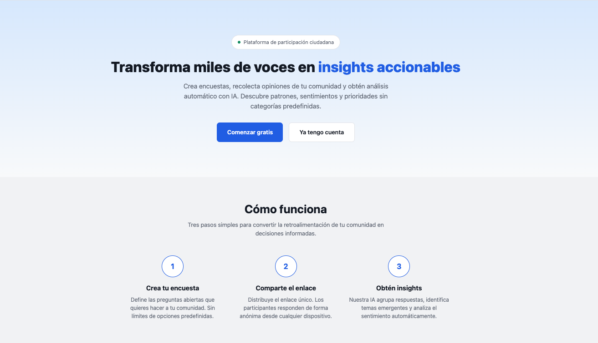
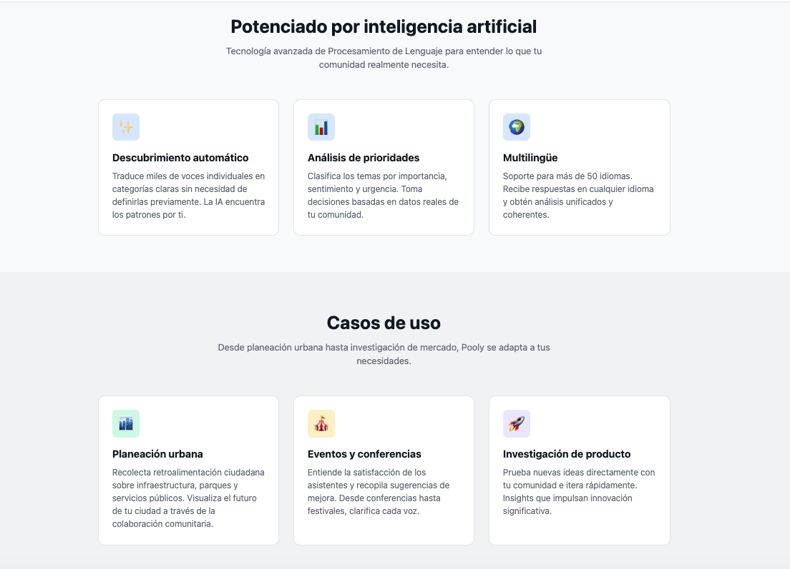
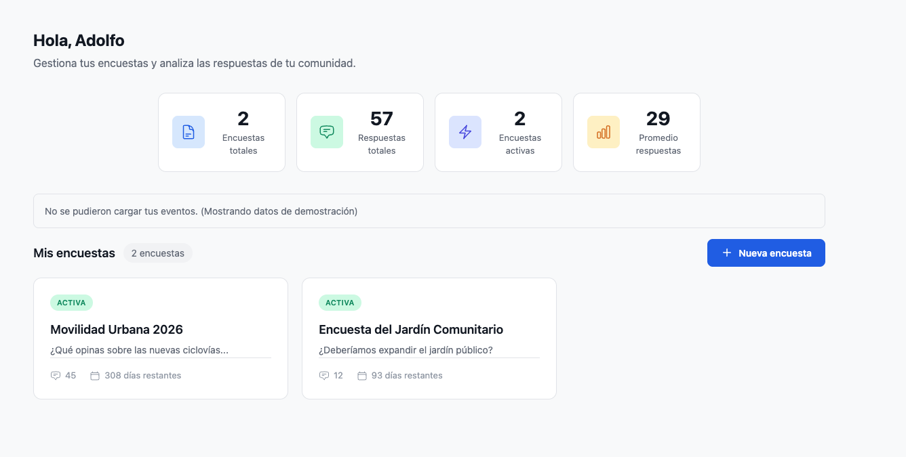
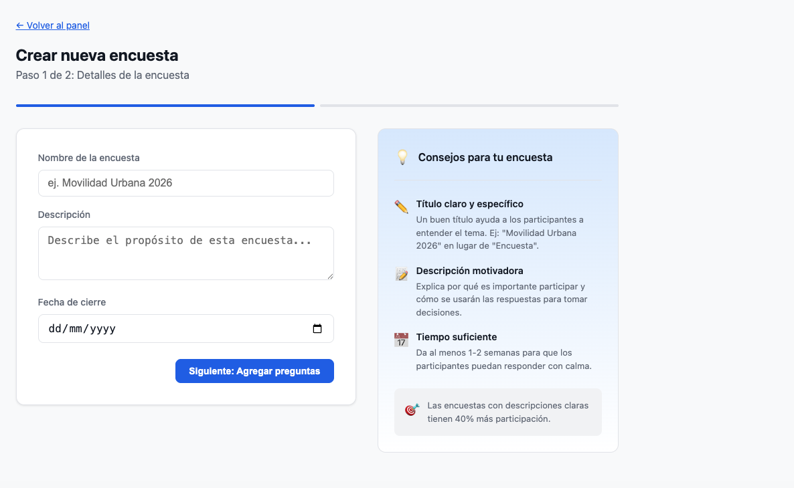
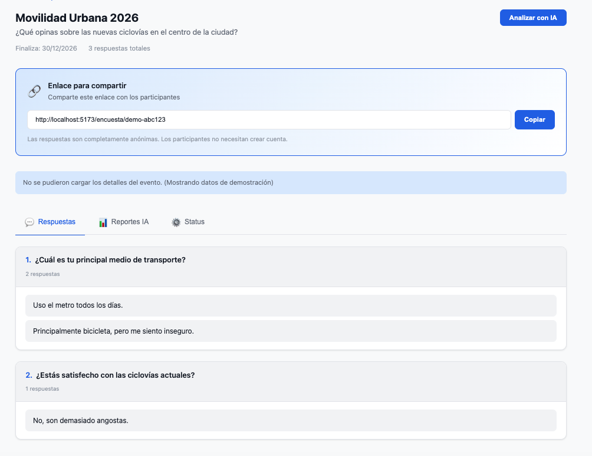
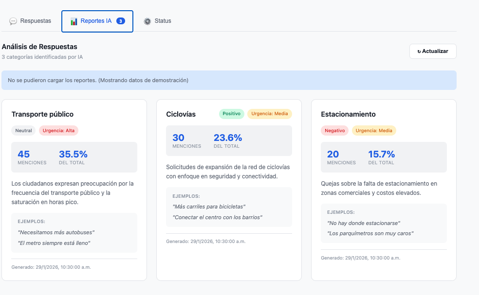
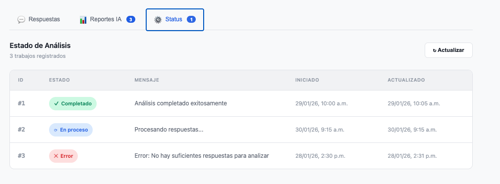

# Pooly UI

Pooly es una plataforma de participacion civica y retroalimentacion comunitaria. Permite crear encuestas abiertas, recopilar respuestas anonimas y aprovechar inteligencia artificial (GPT-4) para analizar automaticamente los resultados, identificando temas emergentes, sentimiento, urgencia y patrones en la retroalimentacion de la comunidad.

## Landing Page

La landing page presenta la propuesta de valor de Pooly: transformar miles de voces en insights accionables en tres pasos simples.



### Potenciado por IA y casos de uso

La plataforma ofrece descubrimiento automatico de patrones, analisis de prioridades y soporte multilingue. Se adapta a distintos contextos: planeacion urbana, eventos y conferencias, e investigacion de producto.



## Panel de control

El dashboard muestra metricas clave (encuestas totales, respuestas, encuestas activas y promedio de respuestas) junto con las encuestas del usuario, su estado y dias restantes.



## Creacion de encuestas

Wizard de 2 pasos para crear encuestas. El primer paso solicita nombre, descripcion y fecha de cierre, acompanado de un panel de consejos para maximizar la participacion.



## Detalle de encuesta y respuestas

Vista de detalle con link compartible para distribuir la encuesta. La pestana de respuestas muestra todas las respuestas agrupadas por pregunta. Desde aqui se puede disparar el analisis con IA.



## Reportes de IA

La IA analiza las respuestas y genera categorias tematicas automaticamente. Cada categoria incluye: sentimiento (positivo/neutral/negativo), nivel de urgencia, numero de menciones, porcentaje del total, resumen y citas de ejemplo.



## Estado de analisis

La pestana de status permite monitorear los jobs de analisis con sus estados (Completado, En proceso, Error), mensajes descriptivos y timestamps.



## Tech Stack

| Categoria | Tecnologia |
|-----------|-----------|
| Framework | React 19 |
| Build tool | Vite 7 |
| Routing | React Router DOM 7 |
| HTTP Client | Axios |
| Estilos | CSS vanilla con variables CSS |
| Linting | ESLint |

## Estructura del proyecto

```
src/
├── pages/                  # Paginas de la aplicacion
│   ├── PublicGallery.jsx          # Landing page (hero, features, casos de uso)
│   ├── Login.jsx                  # Inicio de sesion
│   ├── Register.jsx               # Registro de usuario
│   ├── AdminDashboard.jsx         # Dashboard principal autenticado
│   ├── CreateEvent.jsx            # Wizard de 2 pasos para crear encuestas
│   ├── EventDetails.jsx           # Detalle de encuesta y reportes de IA
│   └── PublicSurvey.jsx           # Pagina publica de encuesta (interfaz tipo chat)
├── components/
│   ├── Modal.jsx                  # Modal reutilizable
│   └── ProtectedRoute.jsx         # Proteccion de rutas autenticadas
├── context/
│   └── AuthContext.jsx            # Manejo de estado de autenticacion
├── layout/
│   └── Navbar.jsx                 # Barra de navegacion
├── services/
│   └── api.js                     # Instancia de Axios con interceptor de auth
└── styles/
    └── index.css                  # Estilos globales
```

## Rutas

| Ruta | Pagina | Auth |
|------|--------|------|
| `/` | Landing page | No |
| `/login` | Inicio de sesion | No |
| `/register` | Registro | No |
| `/admin` | Dashboard | Si |
| `/admin/create` | Crear encuesta | Si |
| `/admin/events/:eventId` | Detalle de encuesta | Si |
| `/encuesta/:publicId` | Encuesta publica | No |

## Conexion al Backend

El frontend se conecta a **[pooly-core](https://github.com/fragosoa/pooly-core)**, el backend de la plataforma.

### Configuracion

La URL del backend se configura en el archivo `.env`:

```env
VITE_API_URL=http://127.0.0.1:8080
```

### Endpoints consumidos

**Autenticacion:**

| Metodo | Endpoint | Descripcion |
|--------|----------|-------------|
| POST | `/login` | Inicio de sesion (retorna `access_token` y objeto `user`) |
| POST | `/create_user` | Registro de nuevo usuario |

**Gestion de encuestas:**

| Metodo | Endpoint | Descripcion |
|--------|----------|-------------|
| GET | `/events` | Obtener encuestas del usuario |
| POST | `/events/new` | Crear nueva encuesta |
| GET | `/events/{eventId}/details` | Obtener detalle de encuesta con preguntas |
| DELETE | `/events/{eventId}` | Eliminar encuesta |

**Encuestas publicas:**

| Metodo | Endpoint | Descripcion |
|--------|----------|-------------|
| GET | `/events/public/{publicId}` | Obtener encuesta publica (sin auth) |
| POST | `/events/public/{publicId}/respond` | Enviar respuestas anonimas |

**Analisis con IA:**

| Metodo | Endpoint | Descripcion |
|--------|----------|-------------|
| POST | `/events/{eventId}/analyze` | Disparar analisis con IA |
| GET | `/events/{eventId}/reports` | Obtener reportes generados por IA |
| GET | `/jobs/event/{eventId}` | Consultar estado del job de analisis |

### Autenticacion

El frontend utiliza autenticacion basada en tokens Bearer. Al iniciar sesion, el backend retorna un `access_token` que se almacena en `localStorage` y se adjunta automaticamente a cada request mediante un interceptor de Axios.

## Instalacion y desarrollo

```bash
# Clonar el repositorio
git clone https://github.com/fragosoa/pooly-ui.git
cd pooly-ui

# Instalar dependencias
npm install

# Configurar variables de entorno
cp .env.example .env
# Editar .env con la URL de tu backend

# Iniciar servidor de desarrollo
npm run dev
```

## Futuras mejoras de experiencia de usuario

### Dashboard avanzado
- **Top 5 panel**: Mostrar las 5 urgencias, oportunidades y emociones mas relevantes al frente del dashboard
- **Visualizaciones**: Barras horizontales para temas principales, donut/barra para distribucion de sentimiento, scatter plot de tema vs urgencia como mapa de prioridad
- **Tablas interactivas**: Columnas de menciones, porcentaje del total, sentimiento y urgencia con drill-down a tarjetas de detalle
- **Acciones sugeridas**: Seccion de "que hago primero" con proximos pasos recomendados por la IA

### Historicos y comparaciones
- Guardar historicos de analisis para comparar resultados en el tiempo
- Comparativos avanzados: tendencias, temas nuevos, indicadores de "subio/bajo"
- Comparar encuestas del mismo tipo o template con indicador de comparabilidad

### Root cause analysis
- Seccion de "hipotesis de causa" basada en evidencia (quotes + razonamiento)
- Proponer 3-5 preguntas de seguimiento practicas para profundizar

### Exportacion de datos
- Exportar resultados y reportes en formato CSV/Excel listos para trabajar

### Mejoras generales de UX
- Notificaciones en tiempo real cuando un analisis se completa
- Modo oscuro
- Soporte multi-idioma (actualmente solo en espanol)
- Code splitting y lazy loading para mejorar tiempos de carga
- Experiencia mobile optimizada con navegacion adaptiva

## Repositorios relacionados

| Repositorio | Descripcion |
|-------------|-------------|
| [pooly-core](https://github.com/fragosoa/pooly-core) | Backend API (autenticacion, gestion de encuestas, analisis con IA) |
| pooly-ui (este repo) | Frontend React |
